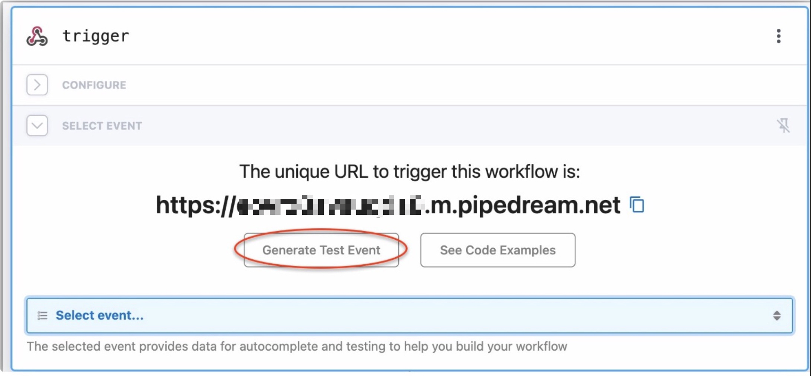

Example code is provided by a community of developers. They are intended to help you get started more quickly, but are not guaranteed to cover all scenarios nor are they supported by Arc XP.

> These examples are licensed under the [MIT license](https://mit-license.org/): THE SOFTWARE IS PROVIDED "AS IS", WITHOUT WARRANTY OF ANY KIND, EXPRESS OR IMPLIED, INCLUDING BUT NOT LIMITED TO THE WARRANTIES OF MERCHANTABILITY, FITNESS FOR A PARTICULAR PURPOSE AND NONINFRINGEMENT. IN NO EVENT SHALL THE AUTHORS OR COPYRIGHT HOLDERS BE LIABLE FOR ANY CLAIM, DAMAGES OR OTHER LIABILITY, WHETHER IN AN ACTION OF CONTRACT, TORT OR OTHERWISE, ARISING FROM, OUT OF OR IN CONNECTION WITH THE SOFTWARE OR THE USE OR OTHER DEALINGS IN THE SOFTWARE.

Reiterated from license above, all code in this example is free to use, and as such, there is NO WARRANTY, SLA or SUPPORT for these examples.

-----

# Description
In this example we will listen for the `story:create` and `story:update` events so that we can send a formatted payload containing some ANS fields to an external service. Pipedream is used here, but can be replaced with any external service. Keep in mind with example code you will likely always have to make *some* changes.

This example code can also be used as a starting point for other behaviors. With some modification, you can format data from any ANS field(s) to send a custom payload to other external services.

# Quick Overview

1.  Set up request in  [Pipedream](https://pipedream.com/)
2.  Ensure  `mytoken`  is defined in  `.env`  file  `mytoken=12345`
3.  Define variables in  `.env`  file
4.  See below for coding instructions

# Instructions

## Set up  [Pipedream](https://pipedream.com/)

We are using a URL generated from  [Pipedream](https://pipedream.com/). We want to set up a custom response so that we can imitate a real third party service.

→ Create a Pipedream account (free)

→ In “Workflows” click “New+”

→ For the trigger, select HTTP / Webhook, then HTTP API Requests


On the next screen, select  **Save and Continue**


Select  **Generate Test Event**, then send the HTTP request



Click  **Continue**


Select  **Return HTTP Response**

****

You can leave it as is or change the response as you would like, then click  **Test**

****

Upon success, give your workflow a name in the upper left corner, then click  **Deploy**

****

## Set env variables

In the root of your project create a file named  `.env`  and add the following lines:

```
# Modify to put your org's URL
contentApiHost=https://api.sandbox.[org].arcpublishing.com

# This is just for testing, never commit PATs in your code!
mytoken=[your Arc XP PAT]

# Add your Pipedream URL
WEBSITE_URL="https://yourURL.m.pipedream.net"
```

## Prepare Handlers

Be sure to run  `npm i`  in your project to install dependencies.

We will use  `story:create`  and  `story:update`  as our test events to receive.

Open  `/src/eventsRouter.json`  and note the following:

```
{
  "storyUpdateHandler": ["story:create", "story:update"]
}
```

## ANS to Use in Testing

Go to your sandbox environment and create a test story, or use an existing one. Then get the ANS from:  `https://api.sandbox.{yourOrg}.arcpublishing.com/content/v4/stories?website={website}&published=true&_id={storyID}`

For sending your test requests, use this format:

```
POST http://localhost:8080/ifx/local/invoke
{
    "organizationId": "myOrgName",
    "currentUserId": "",
    "key": "story:update",
    "typeId": 1,
    "body": {ANS HERE},
    "version": 2,
    "uuid": ""
}
```
For the remainder of the example, you can follow the comments in the code.
